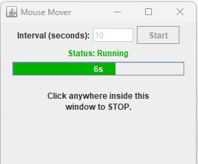

# Mouse Mover Application

A simple Java application that keeps your computer awake by simulating mouse movements at specified intervals.

## Features
- Prevents system from going to sleep
- Configurable movement interval
- Simple and intuitive interface
- Lightweight and efficient

## Prerequisites
- Java Development Kit (JDK) 8 or later
- Windows operating system (for .exe build)

## Download
You can download the latest release from the VibeCoding repository.

## How to Build

### Building JAR File
1. Open Command Prompt in the MouseMover directory
2. Run the following command:
   ```
   javac -d bin src/MouseMover.java
   jar cfm MouseMover.jar src/MANIFEST.MF -C bin .
   ```

### Building Windows Executable (.exe)
1. Ensure you have JDK with jpackage utility installed
2. Run the `package.bat` file:
   ```
   package.bat
   ```
3. The executable will be created in the `dist/MouseMover` directory

## How to Use

### Running from JAR
1. Double-click `MouseMover.jar` or run:
   ```
   java -jar MouseMover.jar
   ```

### Running from EXE
1. Navigate to `dist/MouseMover`
2. Double-click `MouseMover.exe`

### Using the Application
1. Enter the movement interval in seconds
2. Click "Start" to begin mouse movements
3. Click "Stop" to stop the application

## Screenshot


## Troubleshooting
- If the application doesn't start, ensure you have Java installed
- For build issues, verify JDK is properly installed and in your PATH
- Check that all required files are in the correct directories

## License
This project is open source and available under the MIT License.

## Contributing
Contributions are welcome! Please feel free to submit a Pull Request.
